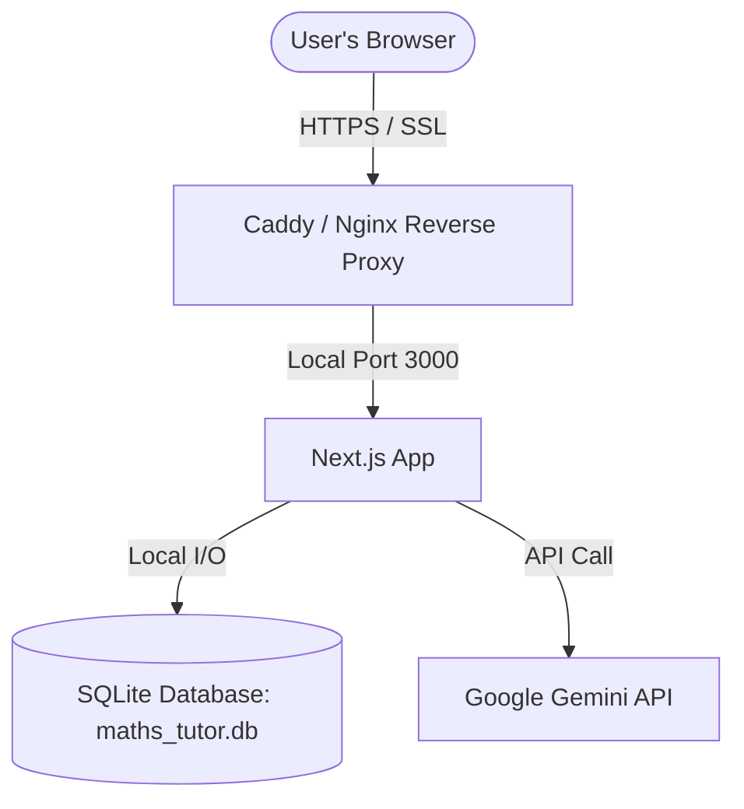
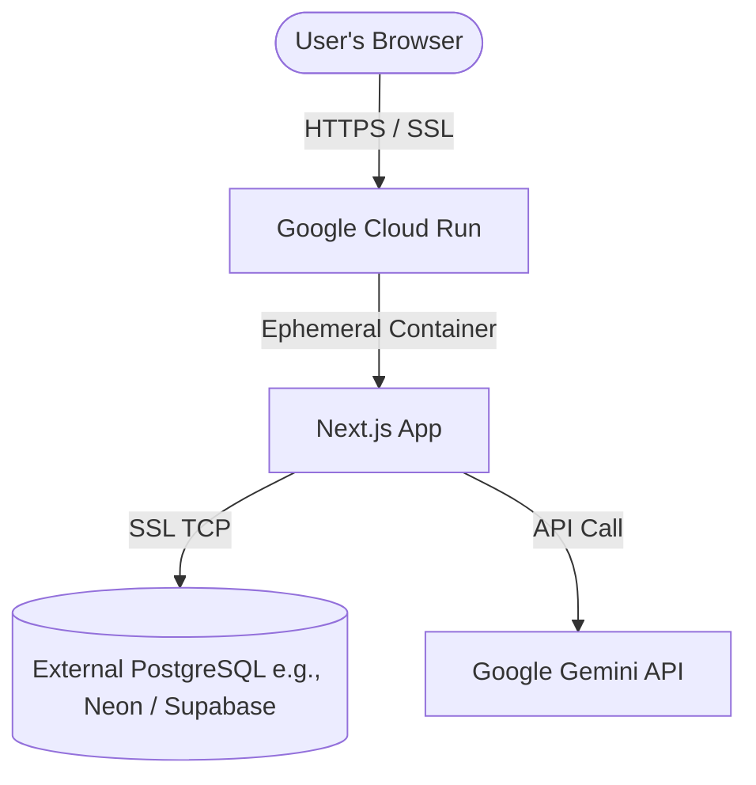

# Deploying Maths Tutor to Google Cloud Platform (GCP)

Since you are on a **Google One** account (which is a consumer subscription for Google Drive, Photos, and Gemini Advanced), you don't receive direct hosting credits. However, **any Google account can sign up for Google Cloud Platform (GCP)**. 

GCP offers:
* **$300 in Free Trial Credits** for 90 days for new signups.
* A **generous Always Free Tier** that includes computing resources you can use indefinitely without charges.

---

## 🛠️ The Architectural Challenge: SQLite Database Persistence

Your application uses **SQLite** (`maths_tutor.db`), which writes data directly to a local file on the disk. This presents a challenge in serverless environments:
* **Serverless platforms (like Google Cloud Run or Vercel)** use ephemeral file systems. When your application scales down to zero or restarts (which happens frequently), any changes written to your SQLite database are permanently wiped out.
* **VMs (like Google Compute Engine)** use persistent disks. The database file stays safe and intact across restarts.

Based on this, here are the two best deployment strategies for your project:

---

## 📊 Deployment Strategy Comparison

| Feature | Option A: Google Compute Engine (VM) 🌟 *Recommended* | Option B: Cloud Run + Serverless PostgreSQL |
| :--- | :--- | :--- |
| **Effort** | Low (no code changes required) | Medium (requires migrating SQLite to Postgres) |
| **Cost** | **100% Free** (using GCP's `e2-micro` Free Tier) | **Free** (using Cloud Run free tier + Supabase/Neon free tier) |
| **Persistence** | Supported out-of-the-box (persistent disk) | Supported via remote DB connection |
| **Scalability** | Good for single-user/family tutor apps | Excellent (scales up and down automatically) |

---

### Option A: Google Compute Engine (VM) Architecture


### Option B: Cloud Run + Serverless Postgres Architecture


---

## 🚀 Option A: Step-by-Step Guide for Compute Engine (VM)

This option uses GCP's **Always Free Tier** `e2-micro` instance.

### Step 1: Create a GCP Project and Billing Account
1. Go to the [Google Cloud Console](https://console.cloud.google.com/).
2. Log in using your Google account.
3. Create a new project (e.g., `maths-tutor`).
4. Set up a billing account. (You will need to input a credit card to verify identity, but you won't be charged as long as you stay within the free tier boundaries).

### Step 2: Launch an Always-Free VM
1. Go to the **Compute Engine** dashboard.
2. Click **Create Instance**.
3. Configure the VM to fit the **Always Free** limits:
   * **Region**: Choose one of `us-central1` (Iowa), `us-east1` (South Carolina), or `us-west1` (Oregon).
   * **Machine configuration**: Select **E2** series, Machine Type **e2-micro** (2 vCPUs, 1 GB memory).
   * **Boot Disk**: Select **Standard Persistent Disk** (do *not* select Balanced or SSD if you want it to be free) and set the size to **30 GB** (the max free capacity).
   * **Operating System**: Select **Ubuntu 24.04 LTS** or **Debian 12**.
   * **Firewall**: Check both **Allow HTTP traffic** and **Allow HTTPS traffic**.
4. Click **Create**.

### Step 3: Install Node.js, git, and Clone the App
Once the VM is running, click the **SSH** button in the console to open a terminal inside your VM. Run the following commands:

```bash
# Update packages
sudo apt update && sudo apt upgrade -y

# Install git, nodejs, npm
curl -fsSL https://deb.nodesource.com/setup_20.x | sudo -E bash -
sudo apt-get install -y nodejs git build-essential

# Clone your project repository
git clone <YOUR_GITHUB_REPOSITORY_URL> maths-tutor
cd maths-tutor

# Install dependencies (better-sqlite3 will compile automatically for the Linux target)
npm install
```

### Step 4: Configure Environment Variables
Create a `.env` file in the root of your project:
```bash
nano .env
```
Add your configuration:
```env
GEMINI_API_KEY=your_gemini_api_key_here
DATABASE_URL="file:./maths_tutor.db"
MOCK_AI=false
PORT=3000
NODE_ENV=production
```
Press `Ctrl+O` then `Enter` to save, and `Ctrl+X` to exit.

### Step 5: Initialize the SQLite Database & Build
```bash
# Run Prisma migrations to set up the database schema
npx prisma migrate deploy

# Run the database seeder if applicable
npm run seed  # Or npx prisma db seed

# Build the Next.js production bundle
npm run build
```

### Step 6: Process Management with PM2
To keep the Next.js app running in the background and surviving server restarts, use `pm2`:
```bash
# Install pm2 globally
sudo npm install -g pm2

# Start the application
pm2 start npm --name "maths-tutor" -- start

# Configure PM2 to start on system boot
pm2 startup
# (Run the command outputted by the startup script under sudo)
pm2 save
```

### Step 7: Expose App with HTTPS using Caddy
Next.js should not be exposed to the web directly on port 3000. It is best practice to run a reverse proxy with automatic SSL (HTTPS). Caddy is the easiest tool for this:
1. Install Caddy on Ubuntu:
   ```bash
   sudo apt install -y debian-keyring debian-archive-keyring apt-transport-https
   curl -1sLf 'https://dl.cloudsmith.io/public/caddy/stable/gpg.key' | sudo gpg --dearmor -o /usr/share/keyrings/caddy-stable-archive-keyring.gpg
   curl -1sLf 'https://dl.cloudsmith.io/public/caddy/stable/debian.deb.txt' | sudo tee /etc/apt/sources.list.d/caddy-stable.list
   sudo apt update
   sudo apt install caddy
   ```
2. Configure Caddy:
   ```bash
   sudo nano /etc/caddy/Caddyfile
   ```
   Replace the content with your domain name (or your VM's external IP address if you don't have a domain yet):
   ```caddy
   your-domain.com {
       reverse_proxy localhost:3000
   }
   ```
   *Note: If using a domain, point your domain's DNS `A` record to your GCP VM's **External IP address**.*
3. Restart Caddy:
   ```bash
   sudo systemctl restart caddy
   ```

---

## 🚀 Option B: Step-by-Step Guide for Cloud Run (Serverless)

If you prefer serverless because it requires no VM management, you must migrate from SQLite to a hosted database like PostgreSQL.

### Step 1: Set up a Free Postgres Database
Since GCP's Cloud SQL is not free, use a free-tier PostgreSQL provider:
* Go to [Neon](https://neon.tech/) or [Supabase](https://supabase.com/).
* Create a free project and copy your database connection string (e.g., `postgresql://...`).

### Step 2: Update Your Code
1. Edit your [schema.prisma](file:///home/tim/Documents/Dev/marbury0/maths_tutor/prisma/schema.prisma):
   ```prisma
   // Change provider to postgresql
   datasource db {
     provider = "postgresql"
     url      = env("DATABASE_URL")
   }
   ```
2. Update the Prisma client instantiation in [prisma.ts](file:///home/tim/Documents/Dev/marbury0/maths_tutor/src/lib/prisma.ts) to remove the `better-sqlite3` adapter:
   ```typescript
   import { PrismaClient } from '@prisma/client'
   
   const prismaClientSingleton = () => {
     return new PrismaClient()
   }
   
   declare global {
     var prismaGlobal: undefined | ReturnType<typeof prismaClientSingleton>
   }
   
   const prisma = globalThis.prismaGlobal ?? prismaClientSingleton()
   export default prisma
   
   if (process.env.NODE_ENV !== 'production') globalThis.prismaGlobal = prisma
   ```

### Step 3: Deploy to Cloud Run using Google Cloud Build
1. Install the Google Cloud SDK locally or use the Cloud Shell.
2. Run the following command in the project directory to build your container and deploy it:
   ```bash
   gcloud run deploy maths-tutor \
     --source . \
     --region us-central1 \
     --allow-unauthenticated \
     --set-env-vars="GEMINI_API_KEY=your_gemini_key,DATABASE_URL=your_postgres_url"
   ```
Cloud Run will automatically build a Docker container for the Next.js app, deploy it, and provide a secure HTTPS URL (e.g. `https://maths-tutor-xxxx-uc.a.run.app`).
